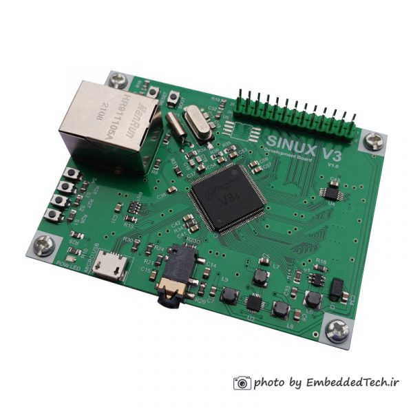

# meta-sinux

## Instruction how to build an image for Sinux V3 in Yocto

### Products:

 <br>
sinux v3 <br>
<br>


## General Note:
Assumed that Linux Ubuntu is installed

## List of tested elements

WiFi <br>
Ethernet <br>
Lcd <br>
Touchscreen <br>
Led  <br>
Backlight for Lcd <br>
Microphone <br>
Headphone <br>

## List of not tested elements

Bluetooth - appears during system boot up <br>

## How to build an images

1. First make sure to following packages are installed in system

```bash
sudo apt-get install gawk wget git-core diffstat unzip texinfogcc-multilib build-essential chrpath socat libsdl1.2-dev xtermlibmpc-dev libgmp3-dev
```

2. Download necessary Yocto packaged listed below. Be sure to be in root of home folder.

```bash
mkdir yocto
cd yocto
mkdir build 
git clone git://git.yoctoproject.org/poky --depth 1 -b dunfell
cd poky
git clone git://git.openembedded.org/meta-openembedded --depth 1 -b dunfell
git clone https://github.com/meta-qt5/meta-qt5.git --depth 1 -b dunfell
git clone https://github.com/mahdi2001h/meta-sinux --depth 1 -b dunfell
```

3. Select directory to build Linux
```bash
source oe-init-build-env ~/yocto/build/sinux_v3
```
4. Modify `bblayers.conf` (located in `~/yocto/build/sinux_v3/conf/`)
```bash
BBLAYERS ?= " \
  ${HOME}/yocto/poky/meta \
  ${HOME}/yocto/poky/meta-poky \
  ${HOME}/yocto/poky/meta-openembedded/meta-oe \
  ${HOME}/yocto/poky/meta-openembedded/meta-networking \
  ${HOME}/yocto/poky/meta-openembedded/meta-python \
  ${HOME}/yocto/poky/meta-qt5 \
  ${HOME}/yocto/poky/meta-sinux \
  "
```
**Note:** Please adapt PATH of conf/bblayers.conf if necessary. <br> <br>

5. Modify `local.conf` (located in `~/yocto/build/sinux_v3/conf`) file

    - modify line with "MACHINE ??" to add "sinux_v3"

    - align *DL_DIR = "${HOME}/yocto/downloads"* <br>

    - align *SSTATE_DIR = "${HOME}/yocto/sstate-cache"* <br>
    
    - align *TMPDIR = "${HOME}/yocto/tmp"* <br>
    
    - add at the end following records <br> 
    *RM_OLD_IMAGE = "1"* <br>
	*INHERIT += "rm_work"* <br>

**Note:** Please adapt rest of `conf/local.conf` parameters if necessary. <br>

6. Build objects
```bash
#console image
bitbake console-image

#qt5 image
bitbake qt5-image

#qt5 toolchain sdk
bitbake meta-toolchain-qt5
```
7. After compilation images appears in

	`~/yocto/tmp/deploy/images/sinux_v3` <br> <br>


8. Insert SD CARD into dedicated CARD slot and issue following command to   write an image

    **Note:** <br>
        Be 100% sure to provide a valid device name (of=/dev/**sde**). Wrong    name "/dev/sde" dameage Your system file ! <br>
    ```bash
    sudo dd if=~/yocto/tmp/deploy/images/sinux_v3/qt5-image-sinux_v3.sunxi-sdimg    of=/dev/sde bs=1024
```


# Audio
audio commands
```bash
#To play mp3 or ogg files type
mpv ogg-file-name.ogg
mpv mp3-file-name.mp3
cvlc mp3-file-name.mp3

#To change volume
amixer set Headphone 10%+
amixer set Headphone 10%-
#or just
amixer set Headphone 10%

#Amixer available options
amixer scontrols

#Microphone on
amixer -c 0 cset numid=12 2

#Record some voice from microphone
arecord -D hw:0,0 -d 3 -f S16_LE -r 16000 tmp.wav

#To get sound device info
ls /dev/snd
```
<br>

# Limitation

- sunxi_mali is probably not working
- rootfs-resize not working (SD CARD size can be resized manualy)
- no wiringpi or similar library to driver GPIO in C code
- discover problem when WiFi connected to access point (probably somedrivers issues), nevertheless WiFi works
